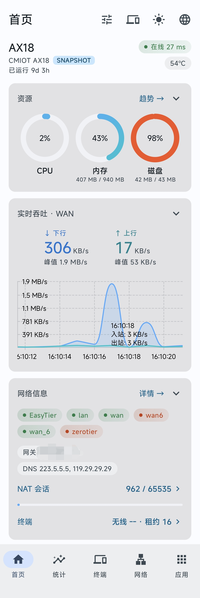
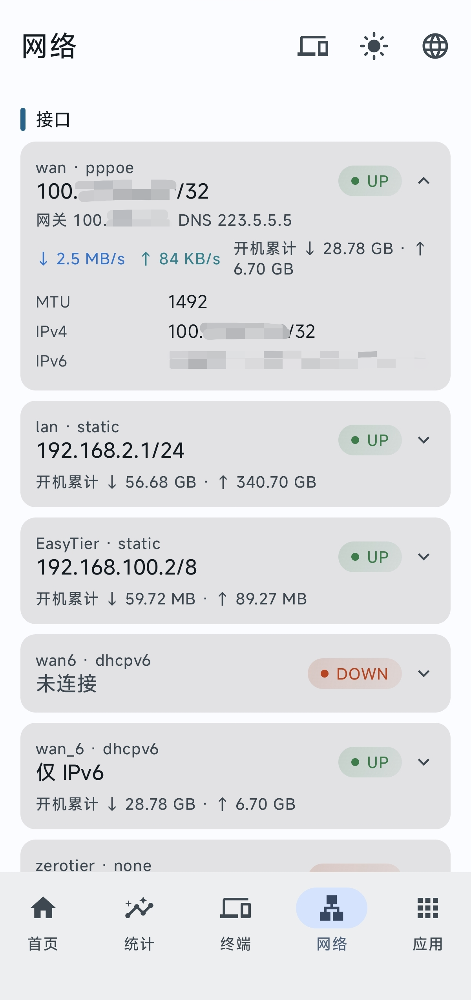
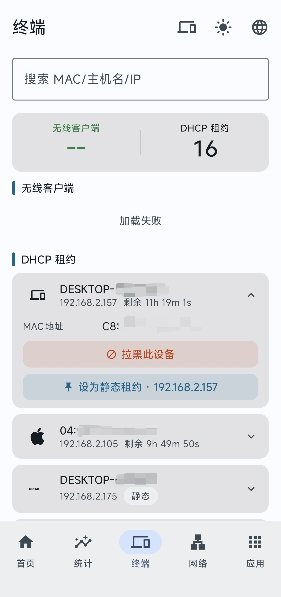
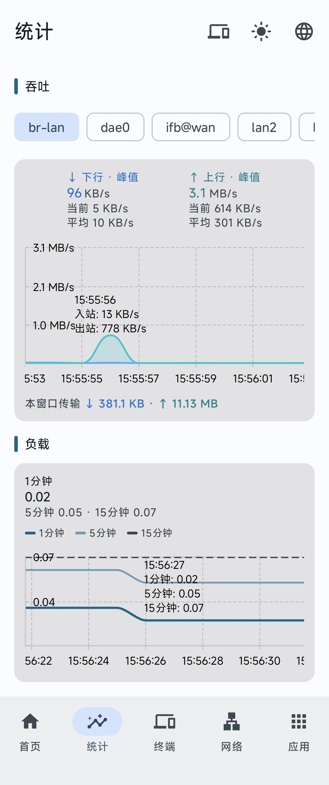
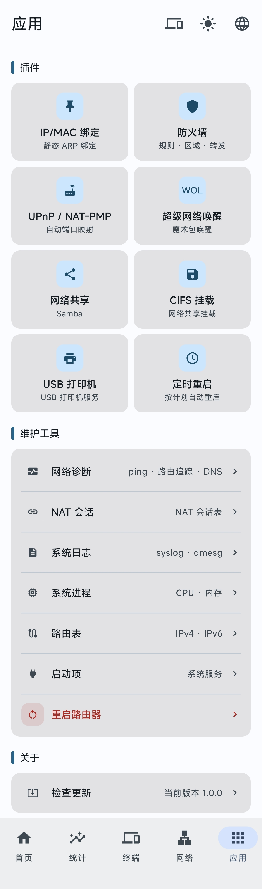

# WrtCtrl

OpenWrt 路由器的 Android 原生管理客户端：仪表盘监控、网络与无线在线编辑、常用插件原生管理，支持添加多台路由器。

Kotlin + Jetpack Compose UI，业务逻辑在 Rust core（`crates/wrtctrl-core`），经 JNI 桥接，通过 rpcd 的 ubus 通道与路由器通信。

> 当前版本 1.0.0，变更见 [CHANGELOG.md](CHANGELOG.md)。

[下载 Releases](https://github.com/wslinnn/WrtCtrl/releases) · [问题反馈](https://github.com/wslinnn/WrtCtrl/issues)

## 预览

<table>
  <tr>
    <td align="center"><a href="docs/img/home.png"></a><br/><b>首页</b></td>
    <td align="center"><a href="docs/img/network.png"></a><br/><b>网络</b></td>
    <td align="center"><a href="docs/img/client.png"></a><br/><b>终端</b></td>
    <td align="center"><a href="docs/img/statistics.png"></a><br/><b>统计</b></td>
    <td align="center"><a href="docs/img/app.png"></a><br/><b>应用</b></td>
  </tr>
</table>

## 特性

- **仪表盘**：CPU / 内存 / 温度环、实时带宽图（点击查值）、NAT 会话、存储挂载点，卡片可排序/显隐/折叠
- **网络**：接口 / 设备 / 无线三视角；radio 与 SSID 在线编辑（含 MTK 固件扩展字段，枚举值来自 iwinfo 实时查询）；Wi-Fi 二维码分享
- **终端**：无线终端列表 + DHCPv4/v6 双栈租约，OUI 厂商识别与品牌图标，防火墙拉黑与静态租约绑定
- **统计**：带宽 / 负载曲线与窗口统计
- **工具**：网络诊断（ping / traceroute / nslookup）、系统日志、NAT 会话、进程、路由表、启动项、重启
- **插件**：luci-app-firewall / luci-app-samba4 / luci-app-upnp / luci-app-wolultra / luci-app-autoreboot / luci-app-arpbind / luci-app-cifs-mount / luci-app-usb-printer 的 schema 驱动原生编辑，功能对齐 LuCI 对应页
- **多路由器**：添加 / 切换 / 编辑多台路由器，密码经 Android Keystore 加密存储，数据按设备隔离
- **安全写路径**：uci 提交统一走 `apply{rollback}` + `confirm`，commit 串行化，会话过期自动预检重登，失败自动回滚
- **传输安全**：HTTPS 模式 TOFU 证书指纹校验（首连记录、换证告警）；密码经 Android Keystore（AES-256-GCM）加密存储，不参与云备份
- **个性化**：中英双语、Material 3 动态色主题、深浅色三态切换

## 架构

```
app (Kotlin/Compose)  ←JNI→  wrtctrl-jni  →  wrtctrl-core (Rust)  →  rpcd ubus (HTTP/JSON-RPC)
```

分层说明与关键设计见 [docs/architecture.md](docs/architecture.md)。

## 安装

从 [GitHub Releases](https://github.com/wslinnn/WrtCtrl/releases) 下载预编译安装包（需 Android 10 及以上），或从源码自行构建。

自行构建需 JDK 17、Android SDK（compileSdk 37，运行目标 targetSdk 35）、NDK 27.2.12479018、Rust stable（含 `aarch64-linux-android` / `x86_64-linux-android` 目标）、cargo-ndk。

```bash
# Rust 单测（宿主机直跑）
cargo test -p wrtctrl-core

# Android 构建（preBuild 自动经 cargo-ndk 构建 Rust），产物在 app/build/outputs/apk/debug/
./gradlew assembleDebug

# 签名 release 构建（签名配置见 docs/contributing.md「签名与发布」）
./gradlew assembleRelease

# 静态检查 + JVM 单测
./gradlew detekt testDebugUnitTest
```

多语言文案由 `tools/gen-strings.mjs` 从 locale JSON 生成，生成产物已随仓库提交（日常构建无需重新生成），机制见 [docs/i18n.md](docs/i18n.md)。

## 路由器要求

- **系统**：OpenWrt，rpcd 正常运行（随 LuCI 默认启用）。app 经 `http(s)://路由器地址/ubus` 通信
- **数据通道**：`luci-rpc`（无线概览、终端提示、接口设备清单）与 `iwinfo`（无线探测、邻居终端）随 LuCI 提供。已装 LuCI 的标准固件开箱即用；精简固件可补齐：

```bash
# opkg（OpenWrt 23.05 及更早）
opkg update
opkg install luci-base rpcd-mod-iwinfo

# apk（OpenWrt 24.10 起默认）
apk update
apk add luci-base rpcd-mod-iwinfo

/etc/init.d/rpcd restart
```

- 确认通道就绪（SSH 到路由器执行）：`ubus list luci-rpc`、`ubus list iwinfo`
- **账号**：具备 LuCI 管理权限的账号（root 默认满足；自建用户需被授予 uci 读写与文件读取 ACL）
- **网络位置**：手机与路由器网络互通即可——同一局域网，或任何可达路由器的网络（如自建的 ZeroTier / EasyTier / Tailscale 等虚拟网络）。地址支持 IP 或域名，app 不经任何云服务中转
- **HTTPS（可选）**：路由器启用 HTTPS 即可，自签名证书受支持——首次连接记录证书指纹，之后证书变化会告警（TOFU）
- **插件功能**：按 uci 配置自动探测，需路由器已安装对应软件包——UPnP（`luci-app-upnp`）、Samba（`luci-app-samba4`）、CIFS 挂载（`luci-app-cifs-mount`）、USB 打印机（`luci-app-usb-printer`）、定时重启（`luci-app-autoreboot`）、IP/MAC 绑定（`luci-app-arpbind`）、网络唤醒（`luci-app-wolultra`）；防火墙（`luci-app-firewall`）为 OpenWrt 内置

## 故障排查

| 问题            | 建议                                                           |
| ------------- | ------------------------------------------------------------ |
| 连接超时          | 检查地址、协议与端口；确认手机与路由器网络互通，路由器防火墙放行 Web 端口（默认 80 / 443）         |
| 域名无法解析        | 检查域名与当前网络的 DNS；若域名仅有 IPv6 记录而当前网络无 IPv6，可改用移动网络，或直接填内网 IP    |
| 认证失败          | 确认使用 LuCI 管理账号与密码，且账号具备管理权限                                  |
| HTTPS 证书告警    | 路由器证书与首次连接的记录不一致（证书重新生成，或存在中间人风险）；确认安全后删除设备重新添加              |
| 网络页 / 终端页无数据 | SSH 到路由器执行 `ubus list luci-rpc` 验证通道；缺失时按「路由器要求」补装组件后重启 rpcd |
| 插件入口不显示       | 对应软件包未安装（app 按 uci 配置探测，未检测到即隐藏）                             |

## 已知限制

- **不内置组网**：app 不提供云中转或异地组网服务；跨网访问请自建通道（ZeroTier、EasyTier、Tailscale 等），app 可直接经这些网络连接路由器
- **厂商识别**：终端页的品牌识别基于内置的常见品牌 OUI 库（约 40 个品牌 / 8600 个前缀），未收录品牌与随机化 MAC 不做猜测，统一显示通用样式；识别结果仅到品牌粒度，不含设备型号
- **熄屏省电**：熄屏后停止后台轮询，回到前台自动恢复刷新（属设计行为而非故障）
- **无互联网 Wi-Fi**：路由器未联外网时，Android 可能对「无互联网」的 Wi-Fi 降级处理，设备列表的在线徽章可能全部显示离线；连接功能不受影响

## 免责声明

- 本项目仍处于早期阶段，部分功能尚未经过充分测试，可能存在未知缺陷；对路由器配置做重要修改前请自行备份
- 本软件按现状提供，不附带任何担保；因使用本软件造成的配置异常、网络中断等问题需自行承担
- 遇到问题或有功能建议，欢迎提交 [Issue](https://github.com/wslinnn/WrtCtrl/issues)

## 贡献

提交规范与验证纪律见 [docs/contributing.md](docs/contributing.md)。

## License

[GPL-3.0](LICENSE)，第三方组件与移植算法的许可说明见 [NOTICE.md](NOTICE.md)。
